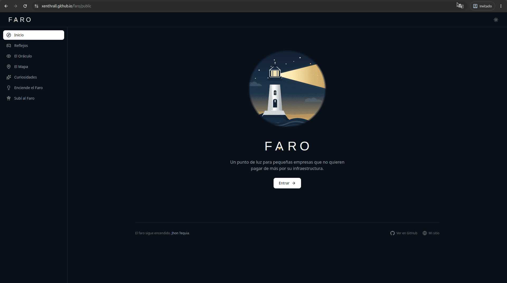
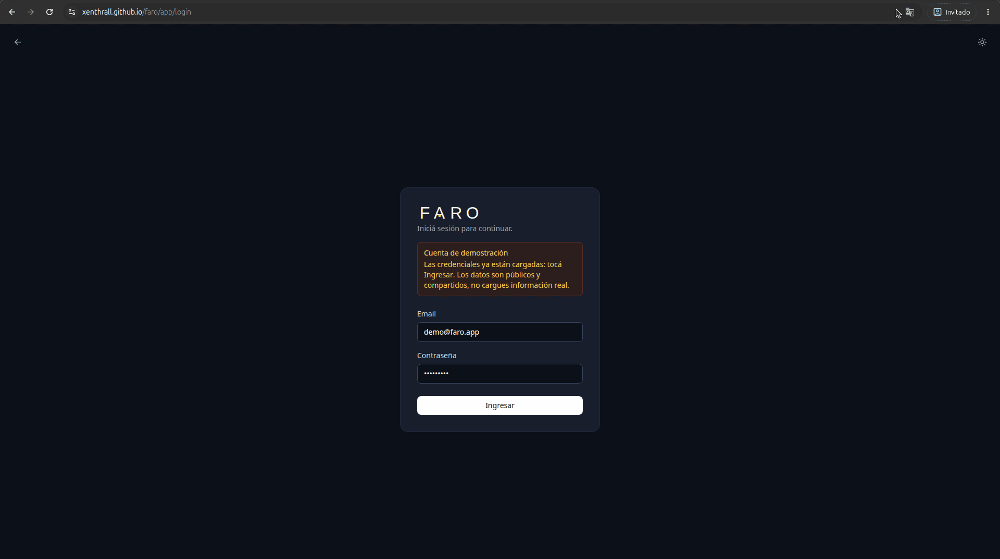
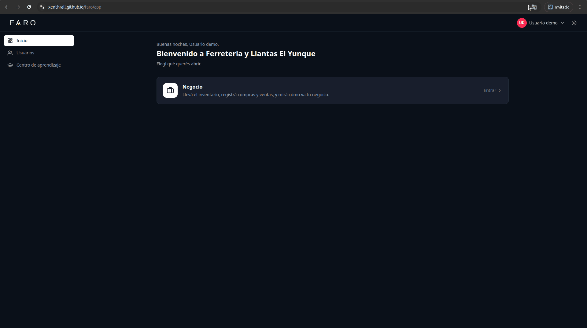
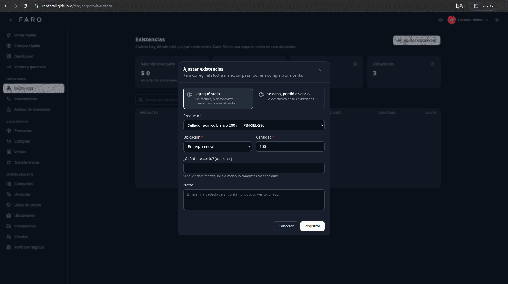
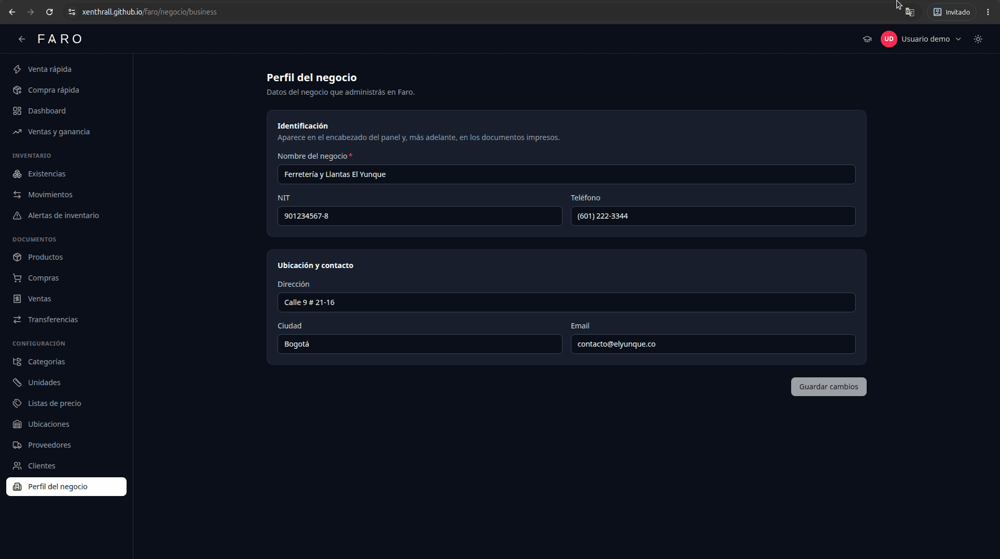
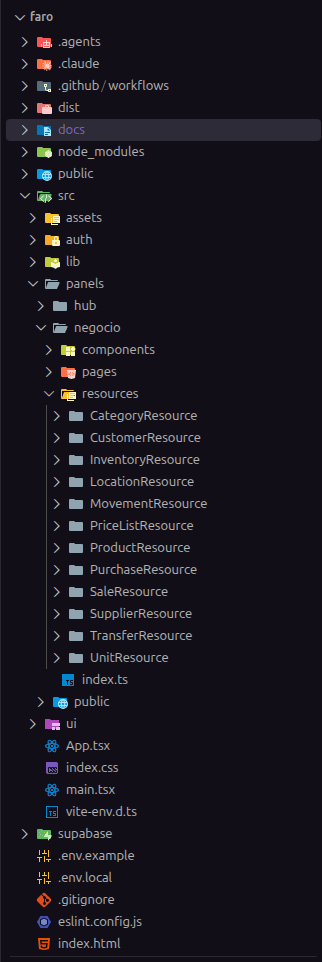

Faro is a management system for small businesses, and the experiment is to build it on zero or near-zero cost infrastructure: use free, managed services for as long as they're enough, and let costs grow only when real usage justifies it.

## The idea

Faro is a static app, published for free on GitHub Pages, that talks directly to Supabase:

- **Data and authentication** on Supabase's free tier (PostgreSQL and Auth), which is quite generous.
- **No application server of its own.** Security lives in the database with Row Level Security: every query is checked in PostgreSQL, not in a backend in between.

*Home · Oct 2026*

## The demo

There's a public demo with a shared account: the credentials are already filled in, you just hit Sign in. The data is public, so don't enter real information.

*Demo account · Oct 2026*

Once inside, a hub brings together access to the panels. Today there's one, the business panel; users live in the hub so every future panel shares the same list.

*Hub · Oct 2026*

## The business panel

The dashboard sums up the day (sales, purchases, margin) and the state of the inventory: its value, products below minimum and lots about to expire.

To correct stock by hand, without going through a purchase or a sale, there's a stock adjustment that is also recorded as a movement.

*Stock adjustment · Oct 2026*

*Business profile · Oct 2026*

## Under the hood

- **A generic data model.** The first use case is a hardware store, but nothing in the schema is specific to that trade. Every product entry is its own cost layer, so a new purchase never overwrites the previous cost and the inventory can be valued for real.
- **Inventory is explained by movements.** The quantity of each product at each location is the sum of its stock ledger, not a number you edit by hand.
- **A panel framework inspired by Filament.** Screens and resources (products, purchases, sales…) are discovered by file: adding one means creating a folder, with no manual registration.

*Code structure · Oct 2026*
