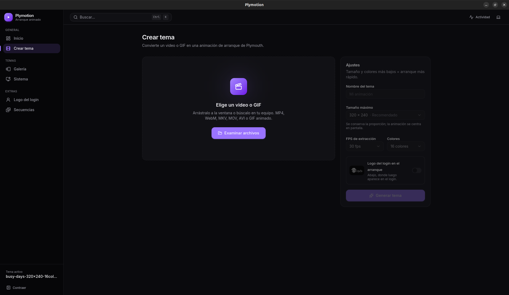
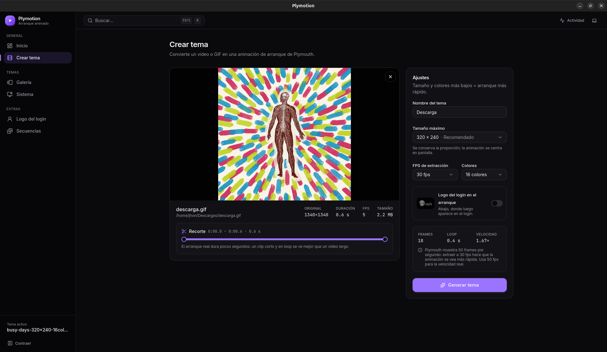
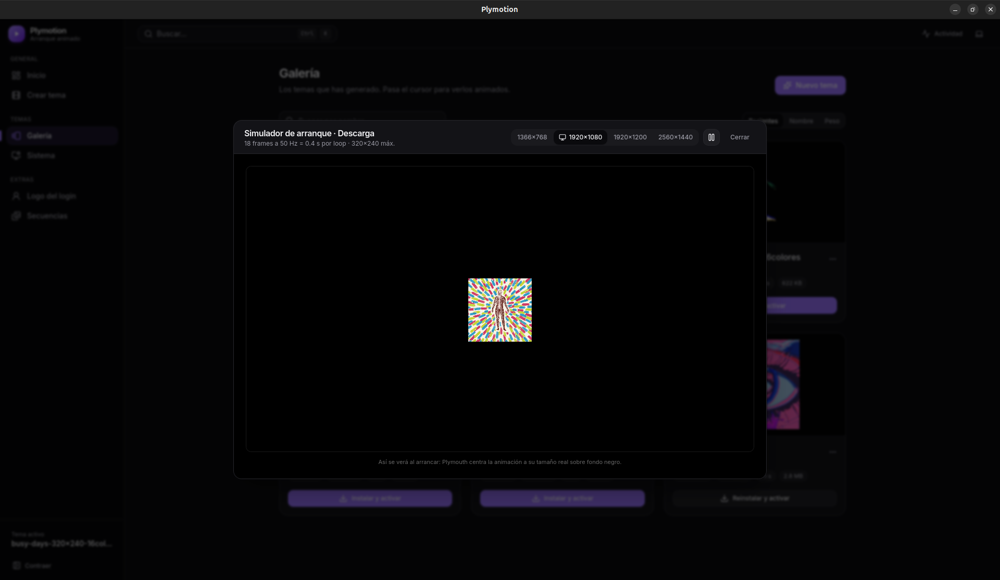
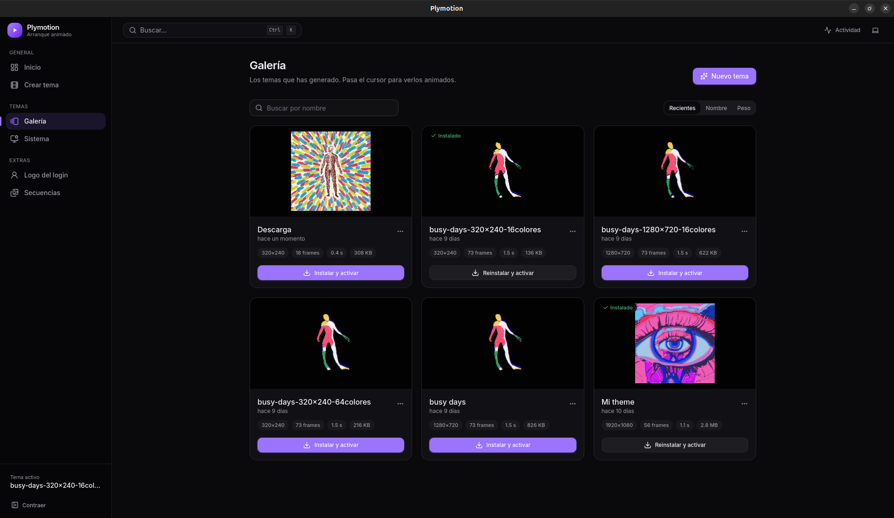
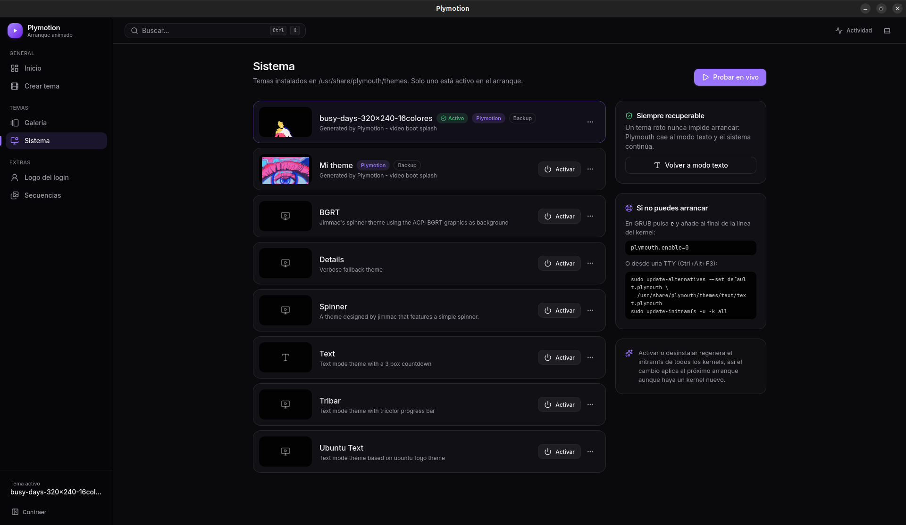
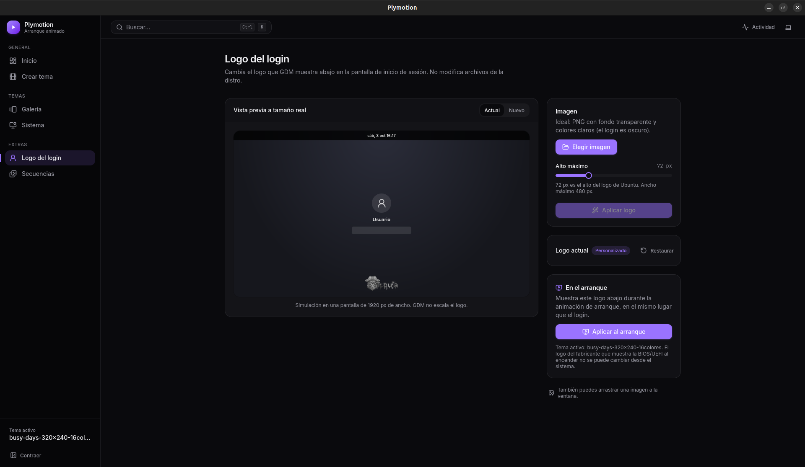

<!-- Jhon: revisa la hipótesis y amplía con tus palabras. -->

Plymotion toma un video o GIF, lo recorta y lo convierte en un tema de Plymouth listo para instalar. Antes de reiniciar, un simulador te muestra cómo se va a ver el arranque.

## Crear un tema

Eliges un video o GIF y ajustas el tamaño, los FPS y la cantidad de colores. Menos tamaño y menos colores significan un arranque más rápido.

*Crear tema · oct 2026*

Sobre la línea de tiempo recortas el clip y ves en vivo cuántos frames salen y cuánto dura el loop. El arranque real dura pocos segundos, así que un clip corto se ve mejor que un video largo.

*Recorte y ajustes · oct 2026*

## Probarlo sin reiniciar

El simulador reproduce el tema como lo hará Plymouth: a 50 Hz, a tamaño real y sobre una pantalla simulada de la resolución que elijas.

*Simulador de arranque · oct 2026*

## Galería y sistema

Los temas que generas quedan en una galería, animados al pasar el cursor, y se instalan con un clic.

*Galería · oct 2026*

En Sistema ves todos los temas instalados y cuál está activo. Si algo sale mal, siempre hay una salida: un tema roto nunca impide arrancar.

*Sistema · oct 2026*

## Logo del login

También reemplaza el logo que GDM muestra en la pantalla de inicio de sesión, con una vista previa a tamaño real antes de aplicarlo.

*Logo del login · oct 2026*

## Lo que estoy probando

- Una app de escritorio local (FastAPI y React en una ventana nativa) que no se instala en el sistema y no deja nada corriendo al cerrarla.
- Cambiar partes delicadas del sistema de forma segura: backup automático, un solo prompt de `pkexec` por acción y un tema roto que nunca impide arrancar.
